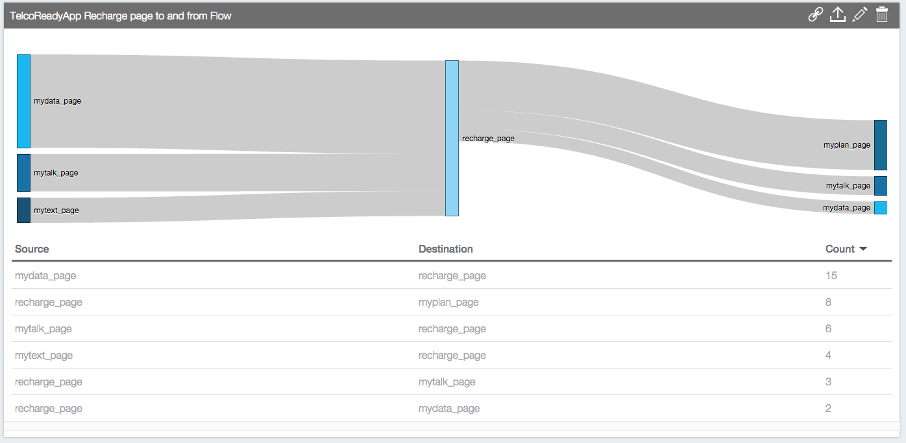
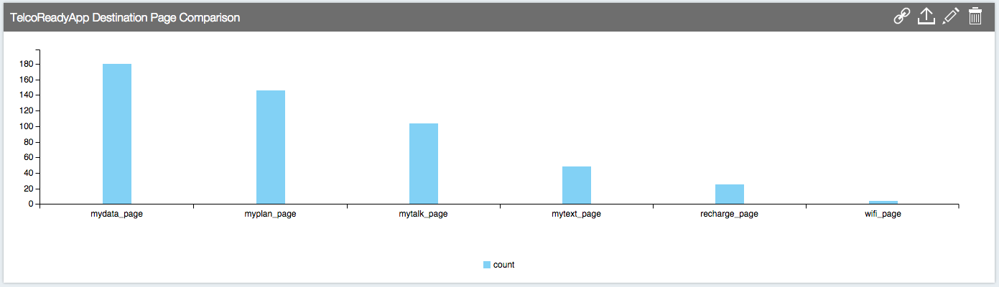
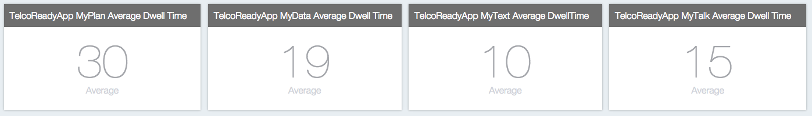
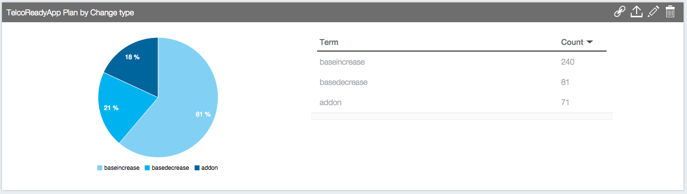
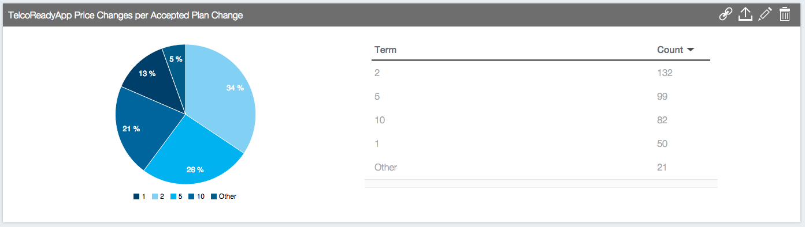

## MobileFirst Platform Operational Analytics 7.0 in Ready-Apps-for-Telecommunications

* [Overview](#overview)
* [Use cases](#use-cases)
    * [User interactions](#user-interactions-page-transitions) (Page Transitions, Dwell Time)
    * [Business metrics](#line-of-business-metrics-plan-change-type) (Plan Change Types, Plan Change Cost, Average Price per Accepted Offer)
* [Conclusion](#conclusion)

#### Overview
Ready-Apps-for-Telecommunications is a full native Android application created by the Mobile Innovation Lab @ IBM. One goal of the project is to illustrate the new capabilities of Operational Anayltics in the MobileFirst Platform Foundation 7.0 which include custom charts accompanied by custom activities.

In American markets, telco providers such as AT&T and Verizon have a plan model which include recurring monthly charges and little to no customization. In South America, Europe and Asia Pacific some smaller telco providers are aggressive in this custom space and allow for custom offerings. The Ready-Apps-for-Telecommunications takes advantage of this custom space.

The Ready-Apps-for-Telecommunications provides a unique experience for telco customers ranging from power users to minimalists and each customer is able to tailor their plan accordingly. Customers are presented with personal offers, fine control on your monthly recurring bill and recharging data when nearing the end of a billing cycle.

Fine grain control for a user means fine grain analytics for a telco.
 
Operational analytics is a tool previously used by IT professionals to monitor and address strengths and possible improvements in their company's MobileFirst Platform Foundation (MFPF) deployment. With the recent update to MFPF 7.0, Operational Analytics added a feature for recording and viewing custom activities captured in a client application with the goal of focusing on line of business metrics. The Mobile Innovation Lab (MIL) at IBM saw this as an opportunity to push the boundaries of the new feature and feed any limitations or improvements back to the Operational Analytics team.

In the recently open sourced example, [Ready App for Telecommunications](https://github.com/IBM-MIL/IBM-Ready-App-for-Telecommunications), the MIL has created a great example to showcase the possibilities of the new custom activities in MFPF. The example is available on the MIL's github and provides a few solid use cases of the Operational Analytics. For the Android code associated with the below examples please visit the [analytics folder](https://github.com/IBM-MIL/IBM-Ready-App-for-Telecommunications/tree/master/TelcoReadyAppAndroid/app/src/main/java/com/ibm/mil/readyapps/telco/analytics) in the Android project on the MIL's github.
#### Use Cases
##### User Interactions 
###### Page Transitions
The first use case stems from a business need to view user interactions with the client side applications. The MIL wished to capture screen transitions as the user navigates through the many screens of the application. Operational Analytics custom activities makes it easy for a developer to create screen transition metrics. The developer needs to record the source and destination screen when a user moves through screens in application. The MIL used Operational Analytics Custom Charts in combination with the screen transition custom activites to construct the following flow charts. The flow charts below illustrate the total pages moving to and from the page pictured in the middle of the graph. In the first flow chart example below the focus page is the recharge screen. The first graph is interpreted as follows: all pages on the left are the source pages going to recharge page and all pages on the far right of the graph are destinations pages leaving from the `recharge page.

	<b>Page Transitions to and from the 'Recharge' screen</b>
	

	<b>Total Page Transitions for Each Page in TelcoReadyApp</b>
	

The page transition graph is great for visualizing user movement through an application but it also has a strong business justification. A business can use these charts to determine where they want to place emphasis on advertising and notifications by now seeing which screen the users are most often visiting. In the Ready App for Telecommunications; the a telco provider is able to infer which part of a mobile plan, users are often shopping for and/or changing. If the flow chart indicates a majority of the destinations in the page transition activities are the `mydata_page`, a telco can use this to infer many users wish to change or monitor their data usage. In the case of a startup or a large corporation looking to constantly receive design feedback, our simple page transition metric can provide such valuable design iteration feedback. By understanding where your users are moving to and from you can understand which screens are too complicated to find or which screens users don't want to see and constantly iterate on the application to improve user experience. The MIL found this first hand when during user testing, many users were stuck on navigating to the wifi finder page which provides a geo query around the users location for all nearby wifi locations. the designers were then able to solidify this feedback using concrete metrics provided by the page transition metric showing that many users were missing the wifi location page. After a few design iterations our team was able to create an improved user experience for this page and allow users to more easily navigate and utilize the powerful wifi finding page.

###### Page Dwell Time

	

The MIL first captured page transition metrics but quickly realized that capturing when a user left a screen for another screen also meant that the client can easily capture how long the person was on the source page before leaving to a destination page, this is dwell time. Dwell Time is the time a user spends on a page. The graph above is a `Metric Group` in Operational Analytics and each box shows the average dwell time per page in seconds.  This new information lead to an even greater understanding of the users' behavior, now a development team can see which pages require the most time and can adjust flow to keep the user moving to crucial profit-producing pages in the application. In the mobile world, it is tough to keep a users attention, especially considering the average use of any application is a few minutes. The dwell time is critical in understanding where every second is spent and why a user may or may not have purchased that last upgrade on that last page of an app.

##### Line of Business Metrics 
###### Plan Change Type

	

The MIL's next set of custom activities focuses on Operational Analytics goal of attracting line of business users. In the Ready-App-For-Telecommunication a user is able to select and change their plan via offers and incremental changes to their base plan. The first visualizatuon shows the plan change type for which a user accepts a plan change. To keep the example simplified, the MIL created three types of plan changes for a telco customer, a base_plan increase, base plan decrease and a recharge. The first two types include an offer or plan change acceptance that results in an increase to a telco customers' monthly recurring bill. The last type, recharge plan, includes any time a telco customer accepts a temporary change to their plan which only applies to the current billing cycle. With a few lines of code a startup or large company is able to gain insight into a customers' purchasing behaviors and adjust their marketing campaign accordingly. While this may not provide the granularity of a large database where analytics are run on a weekly basis, the simplicity and quickness to deploy and capture such purchasing behaviors using Operational Analytics custom activities is incredible. 

###### Plan Change Cost

	

Each plan change also captured the plan change cost associated with the accepted plan change. The graph above shows the a pie chart comparing all plan changes accepted by cost in dollars (USD). This chart provides quick access to information about pricing for offers. A business user can quickly glance at such a graph and see which offer prices are most popular and adjust their market strategy accordingly. 

##### Conclusion
MFPF Operational Analytics was previously thought of as a collection of only IT related data on the MFP Server environment, with the addition of custom activities and Custom Charts the possibilities for MFPF Operational Analytics reach far beyond this. The MIL has illustrated a few compelling use cases for the custom activities and is looking forward to the use cases created by the community. With the few user interaction examples presented above, Operational Analytics could become a center for capturing user interactions in client side applications.

*Tanner Preiss is a software engineer focused on Backend Services and API Design at IBM's Mobile Innovation Lab in Austin, TX. Check out more [blog articles](http://www-969.ibm.com/innovation/milab/blog) from the MIL team and visit our [GitHub page](https://github.com/IBM-MIL) to see our growing list of open source projects.*

- [Learn more about us on our website](http://www-969.ibm.com/innovation/milab/)
- [Follow us on Twitter](https://twitter.com/ibm_mil)
- [See us on Instagram](https://instagram.com/ibm_mil/)

